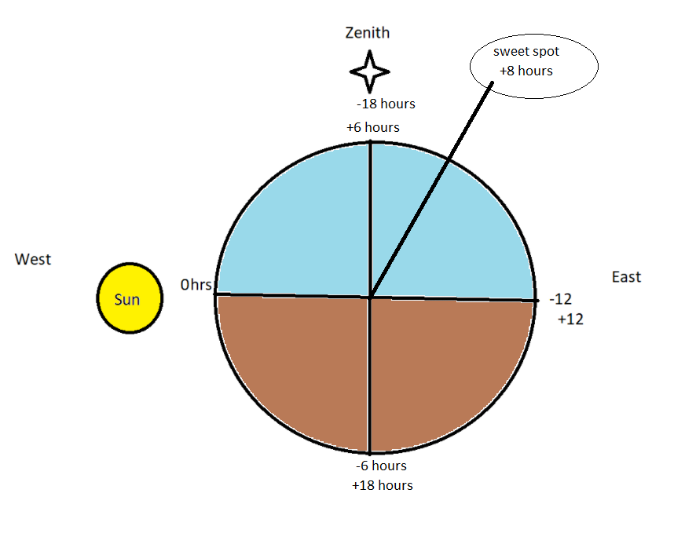

# BAT_AstroTools (==WORK IN PROGRESS==)
<b>Discord Username:</b> Elusin 
<b>Written by:</b> Nick Evans 

# Zenith Optimization Tool (ZOT!)
A tool for computing optimal target timing for astrophotography based on your geographical position (GPS in decimal format).
## [Live Spreadsheet](https://docs.google.com/spreadsheets/d/1vs5LgldoQJ0rpSPKUYhPJgna6vrkzdXtPkJkiIe8Ehs/edit?usp=sharing)
Google Docs - Continual updates to this tool starting here. 

## [Offline Spreadsheet](BAT_Targets_Analysis.xlsx)
Excel spreadsheet - derived from the (live) google docs spreadsheet.
- Has parsing issues from live version
- Works better for sorting

## Python Tools
(unreleased) A python based PANDAS library will be reimplemented to better handle data manipulation since we may have already hit some performance limits of google docs and excel spreadsheets. This will enable us to automated interfacing with other BAT data.
  

# Algorithm(s) Detail
A tool for computing optimal target timing for astrophotography based on your geographical position (GPS in decimal format). This evenly balances the importance of target proximity to zenith based on location and timing. 
- <b>Key assumption:</b> optimal target timing will be 8 hours behind the sun. (you may want to add or remove an hour based on your desired imaging time)
- <b>Upcoming Features:</b> Target Size, Target Type, Refactoring data to not be linked (speed increase)
- Cross-referencing with surveyed global BAT member locations for optimal BAT target selection.

## Credit & References
- References tab in spreadsheet (to be copied here)
- Special Thanks to: slickwill and Zaph